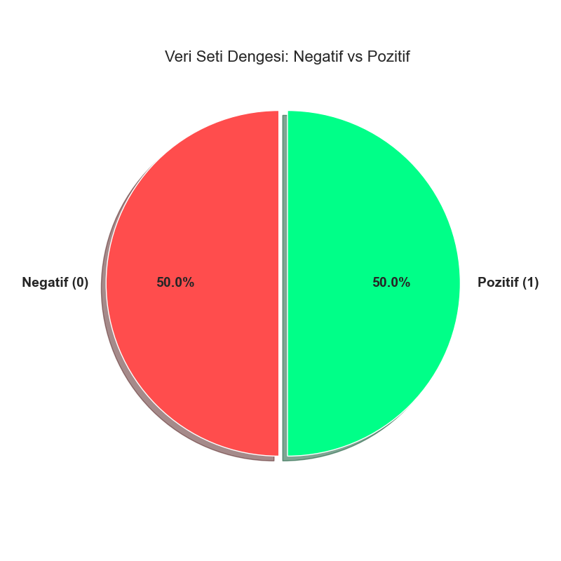
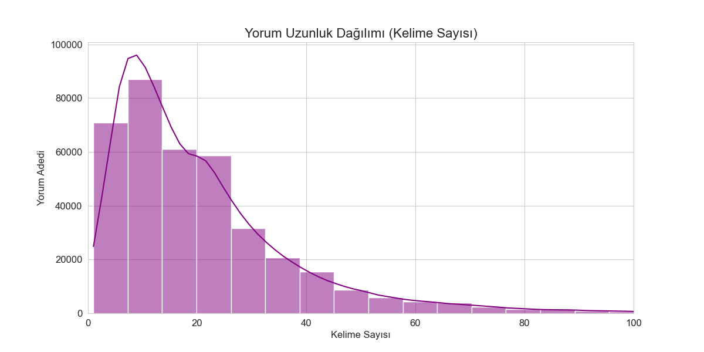
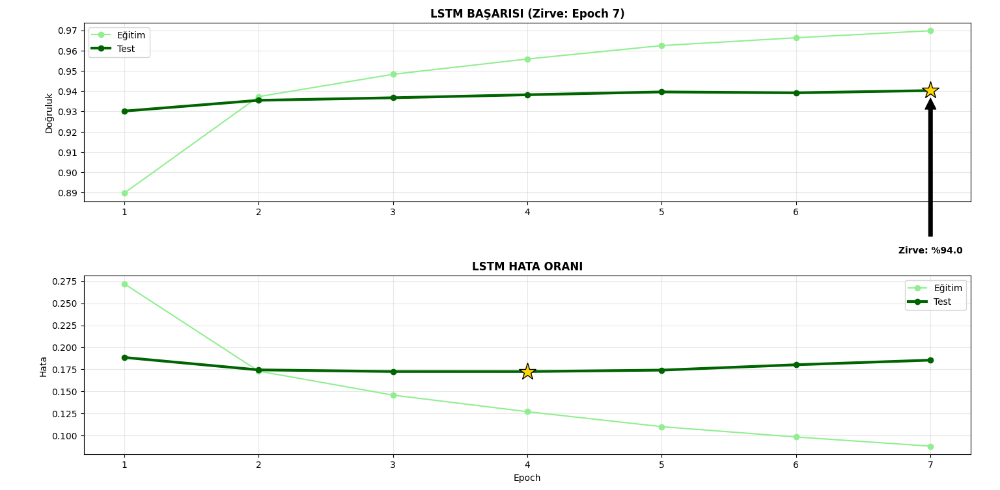
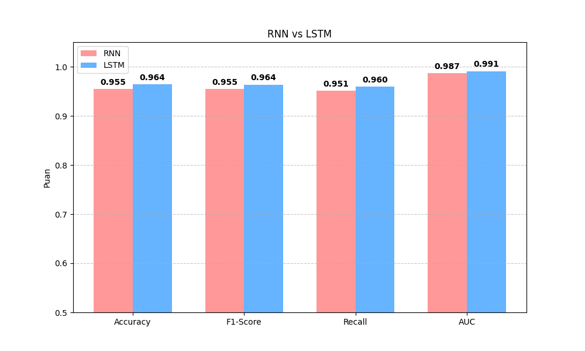
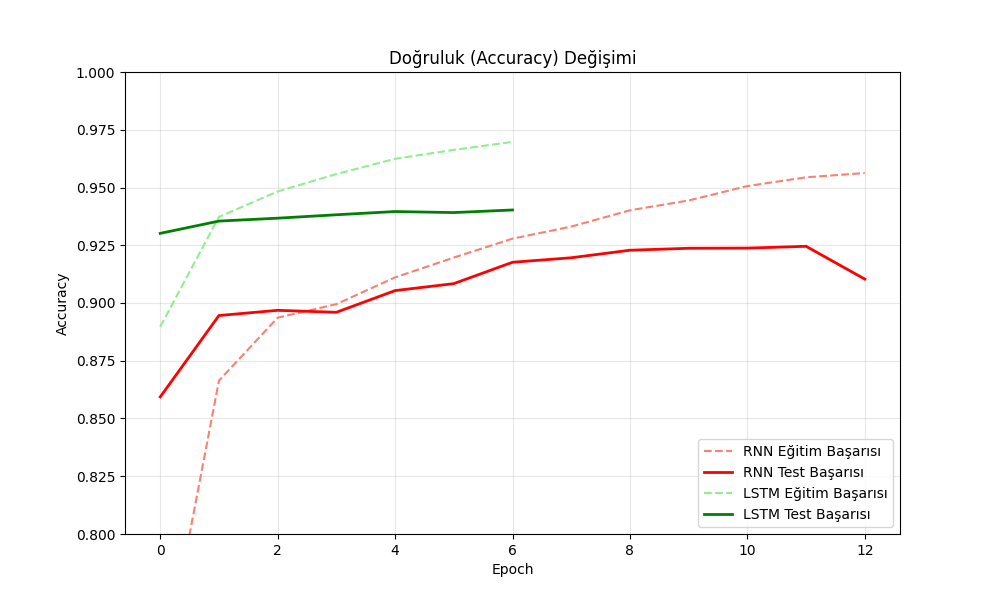
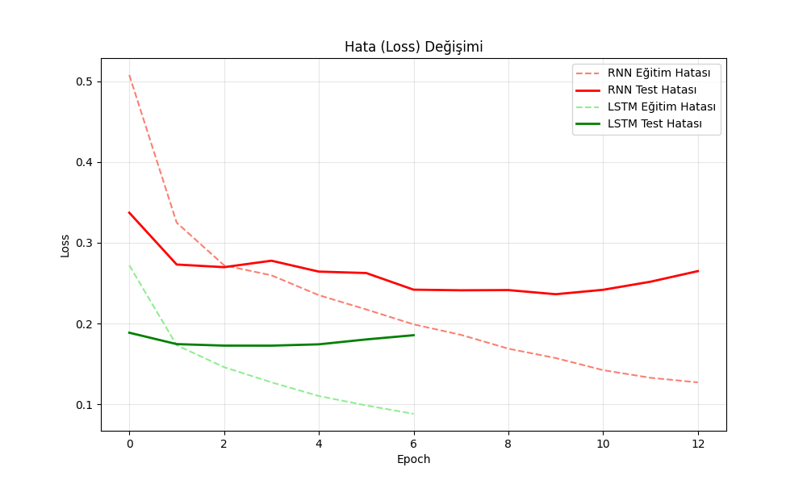
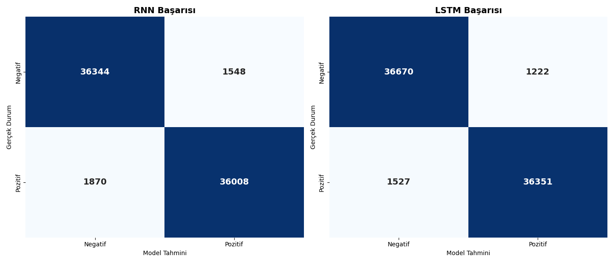
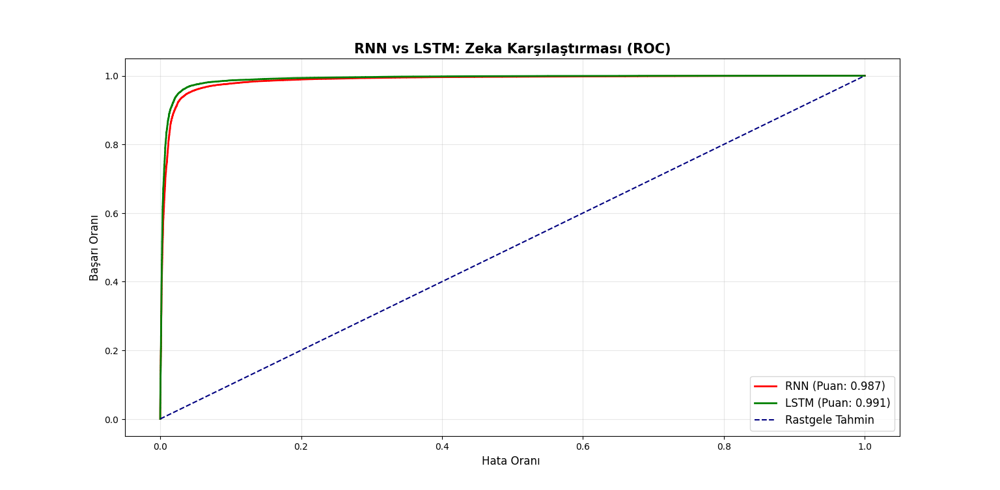

# 🧠 Türkçe Yorum Duygu Analizi (Sentiment Analysis)


Türkçe e-ticaret yorumlarını **RNN** ve **LSTM** derin öğrenme modelleri ile analiz ederek **pozitif / negatif** duygu sınıflandırması yapan uçtan uca bir makine öğrenmesi projesidir. Streamlit tabanlı interaktif bir web arayüzü üzerinden canlı tahmin yapılabilir.

---

## 📑 İçindekiler

- [Özellikler](#-özellikler)
- [Ekran Görüntüleri](#-ekran-görüntüleri)
- [Proje Mimarisi](#-proje-mimarisi)
- [Teknolojiler](#-teknolojiler)
- [Veri Seti](#-veri-seti)
- [Model Mimarisi](#-model-mimarisi)
- [Kurulum](#-kurulum)
- [Kullanım](#-kullanım)
- [Dosya Yapısı](#-dosya-yapısı)
- [Proje Akışı](#-proje-akışı)
- [Değerlendirme Metrikleri](#-değerlendirme-metrikleri)

---

## ✨ Özellikler

- 🔤 **Türkçe NLP** — Türkçe yorumlar üzerinde duygu analizi
- 🤖 **Çift Model** — RNN ve LSTM modellerini aynı anda çalıştırıp karşılaştırma
- 📊 **Güven Skoru** — Her tahmin için yüzdelik güven oranı
- 😐 **Kararsız Bölge** — %45–%55 arası güven skorlarında "Kararsız" etiketi
- 🌐 **Streamlit Web Arayüzü** — Cam efektli, koyu temalı modern UI
- 📈 **Görselleştirme Araçları** — Confusion Matrix, ROC Eğrisi, Loss/Accuracy grafikleri

---

## 📸 Ekran Görüntüleri

| Grafik | Önizleme |
|---|---|
| Veri Dağılımı |  |
| Yorum Uzunluk Dağılımı |  |
| RNN Eğitim Grafikleri |  |
| LSTM Eğitim Grafikleri |  |
| Model Karşılaştırma |  |
| Doğruluk Grafiği |  |
| Hata (Loss) Grafiği |  |
| Confusion Matrix |  |
| ROC Eğrisi |  |

---

## 🏗 Proje Mimarisi

```
Kullanıcı Yorumu
       │
       ▼
  ┌──────────┐
  │ Tokenizer │  (50.000 kelimelik sözlük)
  └────┬─────┘
       │  texts_to_sequences + padding (maxlen=150)
       ▼
  ┌─────────┐      ┌──────────┐
  │ RNN     │      │  LSTM    │
  │ Modeli  │      │  Modeli  │
  └────┬────┘      └────┬─────┘
       │                │
       ▼                ▼
   Olasılık          Olasılık
   (0 – 1)           (0 – 1)
       │                │
       └───────┬────────┘
               ▼
        Sonuç Kartları
   (Pozitif / Negatif / Kararsız)
```

---

## 🛠 Teknolojiler

| Kategori | Teknoloji |
|---|---|
| Programlama Dili | Python 3.x |
| Derin Öğrenme | TensorFlow / Keras |
| Web Arayüzü | Streamlit |
| Veri İşleme | Pandas, NumPy |
| Görselleştirme | Matplotlib, Seaborn, Plotly |
| Metrikler | Scikit-learn |
| Serileştirme | Pickle |

---

## 📦 Veri Seti

- **Kaynak:** [Hepsiburada Türkçe Ürün Yorumları (HuggingFace)](https://huggingface.co/datasets/alibayram/hepsiburada_yorumlar)
- **Ham Veri Boyutu:** ~380.000 yorum (`veri.csv`)
- **Etiketleme Yöntemi:**
  - Puan ≥ 80 → **Pozitif** (1)
  - Puan ≤ 40 → **Negatif** (0)
  - Puan = 60 → **Nötr** (eğitimden çıkarılır)
- **Dengeleme:** Pozitif ve Negatif sınıflar eşit sayıya indirilir (undersampling)
- **Ön İşleme:**
  - 2 karakterden kısa yorumlar temizlenir
  - Tokenizer ile en sık 50.000 kelime sözlüğe alınır
  - `<OOV>` (Out of Vocabulary) token'ı bilinmeyen kelimeler için kullanılır
  - Tüm diziler 150 token uzunluğuna pad edilir

---

## 🧬 Kullanılan Modeller

İki farklı derin öğrenme modeli eğitilmiş ve karşılaştırılmıştır:

### 🔴 RNN (Tekrarlayan Sinir Ağı)
1. Kelimeleri sayısal vektörlere çevirir (50.000 kelimelik sözlük)
2. Cümledeki kelimeleri sırayla okuyarak anlamı çıkarır
3. Sonucu **Pozitif** veya **Negatif** olarak verir

### 🟢 LSTM (Uzun-Kısa Süreli Bellek Ağı)
1. Kelimeleri sayısal vektörlere çevirir (50.000 kelimelik sözlük)
2. Rastgele bazı bağlantıları kapatarak ezber yapmayı önler
3. Cümledeki kelimeleri sırayla okur, önemli kelimeleri **unutmaz**
4. Sonucu **Pozitif** veya **Negatif** olarak verir

> 💡 **Fark:** RNN kısa cümlelerde iyi çalışır, LSTM ise uzun cümlelerdeki bağlamı daha iyi hatırlar.

### Ortak Eğitim Parametreleri

| Parametre | Değer |
|---|---|
| Maksimum Kelime Sayısı | 50.000 |
| Embedding Boyutu | 128 |
| Maksimum Dizi Uzunluğu | 150 |
| Batch Size | 1.024 |
| Epoch (Maks.) | 20 |
| Optimizer | Adam |
| Loss Fonksiyonu | Binary Crossentropy |
| Early Stopping | `val_loss`, patience=3, restore_best_weights |
| Validation Split | %20 |

---

## ⚙ Kurulum

### Gereksinimler

- Python 3.8+
- pip

### Adımlar

```bash
# 1. Repo'yu klonlayın
git clone <repo-url>
cd yorumanaliz

# 2. Gerekli paketleri yükleyin
pip install streamlit pandas numpy tensorflow scikit-learn plotly matplotlib seaborn

# 3. Uygulamayı başlatın
streamlit run app.py
```

> **✅** Eğitilmiş modeller ve hazır veriler repo'da mevcuttur. Klonladıktan sonra doğrudan çalıştırabilirsiniz.

> **📌 (Opsiyonel) Modelleri sıfırdan eğitmek isterseniz:**
> 1. `veri.csv` dosyasını [HuggingFace](https://huggingface.co/datasets/alibayram/hepsiburada_yorumlar)'den indirip proje klasörüne kaydedin
> 2. Sırasıyla çalıştırın:
>    - `python verihazırlık1.py` → dengeli_veri.csv
>    - `python verihazırlık2.py` → tokenizer.pickle + hazir_veri.csv
>    - `python RnnEgitim.py` → rnn_model.keras
>    - `python LstmEgitim.py` → lstm_model.keras

---

## 🚀 Kullanım

```bash
streamlit run app.py
```

Tarayıcınızda otomatik olarak açılır 

1. Metin kutusuna Türkçe bir yorum yazın
2. **"🚀 ANALİZ ET"** butonuna tıklayın
3. RNN ve LSTM modellerinin sonuçlarını yan yana görün

---

## 📂 Dosya Yapısı

```
yorumanaliz/
│
├── app.py                 # 🌐 Streamlit web arayüzü (ana uygulama)
│
├── verihazırlık1.py       # 📥 Ham veriyi temizler, dengeler → dengeli_veri.csv
├── verihazırlık2.py       # 📚 Tokenizer oluşturur → tokenizer.pickle + hazir_veri.csv
│
├── RnnEgitim.py           # 🔴 RNN modeli eğitimi → rnn_model.keras
├── LstmEgitim.py          # 🟢 LSTM modeli eğitimi → lstm_model.keras
│
├── metriklerveloss.py     # 📊 Metrik karşılaştırma + Loss/Accuracy grafikleri
├── lstmrnngrafik.py       # 📈 RNN & LSTM eğitim süreç grafikleri
├── matrixveroc.py         # 🎯 Confusion Matrix & ROC Eğrisi
├── veridagilim.py         # 🥧 Veri dağılımı ve yorum uzunluk grafikleri
├── verisayim.py           # 🔢 Ham veri istatistikleri
│
├── veri.csv               # 📄 Ham yorum verisi (~380K satır)        → HuggingFace'den indirilir (repo'da yok)
├── dengeli_veri.csv       # ⚖️ Dengelenmiş veri
├── hazir_veri.csv         # ✅ Eğitime hazır veri
│
├── rnn_model.keras        # 🧠 Eğitilmiş RNN modeli
├── lstm_model.keras       # 🧠 Eğitilmiş LSTM modeli
│
├── yorum.txt              # 🧪 Test yorumları (pozitif, negatif, tuzak)
│
├── resimler/              # 🖼️ Proje görselleri
│   ├── VeriDagilim.png
│   ├── YorumUzunlukGrafik.png
│   ├── RnnGrafik.png
│   ├── LstmGrafik.png
│   ├── Degerlendirmeler.png
│   ├── DogrulukGrafik.png
│   ├── HataGrafik.png
│   ├── matrix.png
│   └── RocEgri.png
│
└── README.md
```

---

## 🔄 Proje Akışı

```
veri.csv (Ham Veri)
    │
    ▼
verihazırlık1.py ──► dengeli_veri.csv (Temizlenmiş & Dengelenmiş)
    │
    ▼
verihazırlık2.py ──► hazir_veri.csv + tokenizer.pickle (Sözlük)
    │
    ├──► RnnEgitim.py  ──► rnn_model.keras  + rnn_history.pickle
    │
    └──► LstmEgitim.py ──► lstm_model.keras + lstm_history.pickle
                │
                ▼
           app.py (Streamlit Arayüzü)
                │
                ▼
     Canlı Yorum Analizi 🚀
```

---

## 📊 Değerlendirme Metrikleri

Proje aşağıdaki metriklerle değerlendirilmektedir:

| Metrik | Açıklama |
|---|---|
| **Accuracy** | Genel doğruluk oranı |
| **Precision** | Pozitif tahminlerin ne kadarının gerçekten pozitif olduğu |
| **Recall** | Gerçek pozitiflerin ne kadarının yakalandığı |
| **F1-Score** | Precision ve Recall'un harmonik ortalaması |
| **AUC** | ROC eğrisi altında kalan alan |
| **MCC** | Matthews Korelasyon Katsayısı (dengesiz veriler için güçlü metrik) |

Görselleştirme scriptleri:
- `metriklerveloss.py` → Tüm metriklerin bar grafik karşılaştırması + Loss/Accuracy eğrileri
- `matrixveroc.py` → Confusion Matrix + ROC eğrisi
- `lstmrnngrafik.py` → Epoch bazlı eğitim performans grafikleri

---

## 📝 Lisans

Bu proje eğitim amaçlı geliştirilmiştir.
